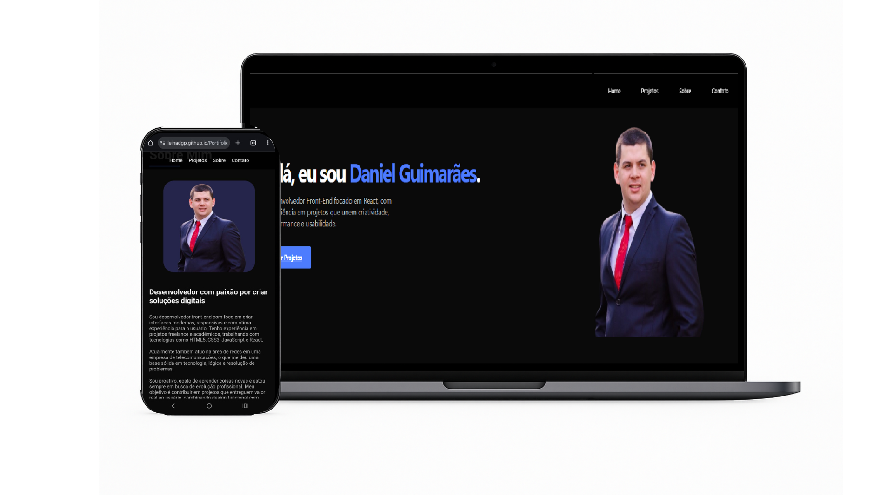

# 👨‍💻 Portfólio | Daniel Guimarães Pedrozo

Bem-vindo ao meu portfólio de desenvolvedor front-end! Aqui você encontrará meus principais projetos, habilidades técnicas, e formas de contato profissional.

# 🖼️ Demonstração

  

# 🧩 Sobre Mim

Sou um desenvolvedor front-end de Taquara/RS, com experiência em projetos freelance e acadêmicos. Tenho paixão por criar interfaces modernas, funcionais e responsivas.

Atualmente atuo também na área de redes, e estou sempre em busca de novos desafios e aprendizados.

# 🚀 Tecnologias que utilizo

- HTML5, CSS3, JavaScript (ES6+)
- React, Styled Components
- PHP, MySQL
- Git & GitHub
- Hospedagem: GitHub Pages, InfinityFree

# 🖼️ Projetos em Destaque

| Projeto               | Tecnologias        | Link                                                                 |
|-----------------------|--------------------|----------------------------------------------------------------------|
| 🎬 Dev Movies         | React, Swiper.js   | [Ver Projeto](https://leinadgp.github.io/projeto_dev_movie/)         |
| ✅ Lista de Tarefas   | React, Styled-Comp | [Ver Projeto](https://leinadgp.github.io/Lista_Tarefas/)           |
| 🍔 Hamburgueria CRUD  | PHP, MySQL, JS     | [Ver Projeto](https://danielguimaraes.infinityfree.me)              |
| 💼 Ver Todos Projetos | GitHub             | [GitHub Repos](https://github.com/leinadgp?tab=repositories)        |

# 🌐 Acesse o Portfólio Online

👉 [danielguimaraes.vercel.app](https://leinadgp.github.io/projeto_dev_movie/)

# 📫 Contato

- 📧 Email: leinadgp@gmail.com
- 💼 [LinkedIn](https://linkedin.com/in/danielguimaraespedrozo/)
- 🐱 [GitHub](https://github.com/leinadgp)

# 🏆 Certificações

- 
- 

---

